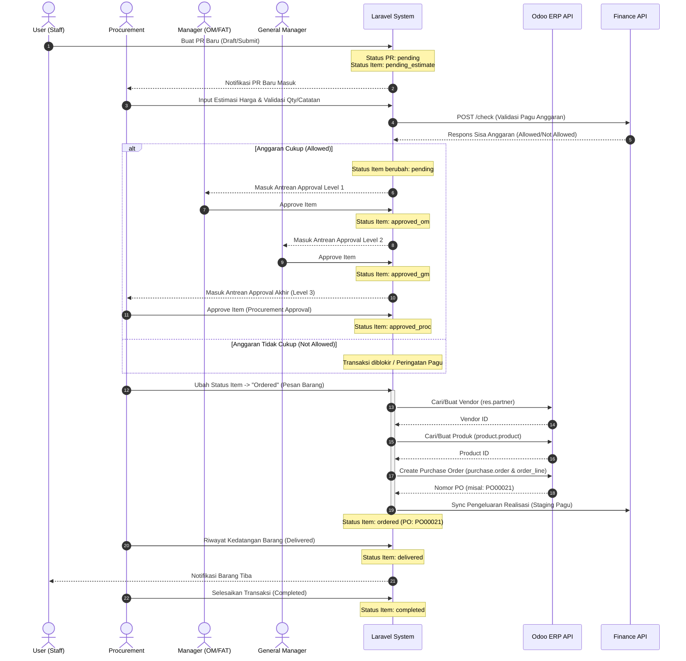

# Dokumentasi Teknis Lengkap: Sistem Procurement & Integrasi Odoo ERP v2.0
**PT. Herbatech Innopharma Industry**

Dokumen ini berisi penjelasan menyeluruh mengenai arsitektur sistem, struktur database, detail alur proses (workflow), konfigurasi *environment*, serta arsitektur integrasi API (Odoo & Finance) pada aplikasi **Procurement**.

---

## 1. Arsitektur & Teknologi Utama

Sistem dibangun menggunakan kerangka kerja modern untuk menjamin performa, keamanan, dan skalabilitas:
*   **Backend Framework:** Laravel 10 (PHP 8.2)
*   **Database:** MySQL / PostgreSQL
*   **Frontend UI:** AdminLTE 3 (Bootstrap 4 & AdminLTE Dashboard wrapper)
*   **Integrasi ERP:** Odoo JSON-RPC client (menggunakan Laravel HTTP Client bawaan)
*   **Integrasi Finance:** REST API (JSON over HTTPS)
*   **Sistem Otorisasi:** Spatie Laravel-Permission (Role & Permission management)

---

## 2. Diagram Alur Proses (Workflow)

Berikut adalah diagram alur hidup (*lifecycle*) pengajuan **Purchase Request (PR)** dari awal pembuatan hingga pengadaan selesai dan terintegrasi dengan Odoo ERP & Finance:



---

## 3. Detail Database & Model

Sistem menggunakan relasi database berikut untuk memproses pengajuan:

### A. Model `PurchaseRequest`
Merepresentasikan satu berkas dokumen pengajuan yang dapat berisi beberapa item barang.
*   `pr_number` (string, unique): Nomor PR yang dihasilkan otomatis oleh trait [GeneratesPrNumber](file:///c:/laragon/www/procurementversiA/app/Traits/GeneratesPrNumber.php) dengan reset bulanan per departemen.
*   `user_id` (foreignId): Relasi ke pembuat PR.
*   `department_id` (foreignId): Departemen asal pengaju.
*   `request_date` (date): Tanggal pengajuan.
*   `purpose` (string): Kategori anggaran/tujuan pengadaan.
*   `pr_type` (enum): `operational` atau `non_operational`.
*   `status` (enum): `draft`, `pending`, `approved_om`, `approved_gm`, `approved_proc`, `cancelled`.
*   `total_amount` (decimal): Total akumulasi harga estimasi semua item.

### B. Model `PrItem`
Item spesifik barang di dalam satu dokumen PR.
*   `purchase_request_id` (foreignId): Relasi ke PR induk.
*   `item_name` (string): Nama barang yang diajukan.
*   `description` (text): Spesifikasi lengkap barang.
*   `quantity` (decimal): Jumlah unit barang.
*   `uom` (string): Satuan ukuran barang.
*   `estimated_price` (decimal): Harga estimasi dari Procurement (diisi di tahap `pending_estimate`).
*   `actual_price` (decimal): Harga riil saat dipesan (diisi di tahap `ordered`).
*   `total_price` (decimal): `quantity` × `estimated_price`.
*   `actual_total_price` (decimal): `quantity` × `actual_price`.
*   `status` (enum): `pending_estimate`, `pending`, `approved_om`, `approved_gm`, `approved_proc`, `ordered`, `delivered`, `completed`, `rejected_om`, `rejected_gm`, `rejected_proc`.
*   `po_number` (string): Nomor Purchase Order dari Odoo.
*   `revision_count` (integer): Jumlah kali item ini direvisi oleh user.

### C. Model `Approval`
Histori jejak persetujuan, penolakan, atau pengiriman catatan validasi untuk tiap item PR.
*   `purchase_request_id` (foreignId): Relasi ke PR induk.
*   `pr_item_id` (foreignId): Relasi ke item PR terkait.
*   `approver_id` (foreignId): Relasi ke User pengambil tindakan.
*   `approver_role` (string): Peran saat menyetujui (`operational_manager`, `manager_fat`, `general_manager`, `procurement`, `superadmin`).
*   `approval_type` (string): Level approval (`om`, `fatm`, `gm`, `procurement`, `requester`).
*   `status` (enum): `approved`, `rejected`, `pending` (untuk catatan validasi/diskusi).
*   `notes` (text): Alasan penolakan, catatan approval, atau isi memo.

---

## 4. Integrasi Odoo ERP API (JSON-RPC)

Komunikasi dengan Odoo ERP ditangani secara eksklusif oleh class service [OdooService](file:///c:/laragon/www/procurementversiA/app/Services/OdooService.php).

### A. Metode Koneksi JSON-RPC
Integrasi murni menggunakan HTTP client bawaan Laravel (`Http::post`) ke endpoint `/jsonrpc` Odoo menggunakan metode pemanggilan `execute_kw`.

```php
// Pemanggilan execute_kw
$response = Http::post("{$this->url}/jsonrpc", [
    'jsonrpc' => '2.0',
    'method' => 'call',
    'params' => [
        'service' => 'object',
        'method' => 'execute_kw',
        'args' => [
            $this->db,
            $this->uid,
            $this->password,
            $model,
            $method,
            $args,
            $kwargs
        ]
    ],
    'id' => rand(1, 1000)
]);
```

### B. Otomatisasi Master Data (Auto-healing)
Untuk memastikan data transaksi tidak gagal akibat perbedaan master data di Odoo, sistem melakukan pengecekan berantai:
1.  **Vendor Resolution (`getOrCreatePartner`)**:
    *   Sistem mencari record partner di Odoo berdasarkan nama: `[['name', '=', $vendorName], ['supplier_rank', '>', 0]]`.
    *   Jika tidak ditemukan, OdooService langsung membuat partner baru dengan `supplier_rank = 1` dan `is_company = true`.
2.  **Product Resolution (`getOrCreateProduct`)**:
    *   Mencari produk berdasarkan nama: `[['name', '=', $productName]]`.
    *   Jika belum terdaftar di Odoo, sistem otomatis membuat produk dengan type `consu` (consumable) dan status `purchase_ok = true`.

### C. Pembuatan PO (Satu Request Payload)
Pembuatan Purchase Order (`purchase.order`) dan baris item barang (`order_line`) dikirimkan dalam satu kesatuan payload menggunakan format array command Odoo `[0, 0, {values}]` untuk efisiensi transfer data:

```php
$orderLines[] = [0, 0, [
    'product_id' => $productId,
    'name' => $item->description ?: $item->item_name,
    'product_qty' => (float) $item->quantity,
    'price_unit' => (float) $item->actual_price,
    'date_planned' => $item->due_date,
    'product_uom' => $uomId,
]];
```

---

## 5. Integrasi Finance API (Staging Pagu & Validasi Anggaran)

Aplikasi Procurement terhubung secara eksternal ke sistem Finance melalui protokol REST API untuk mengontrol anggaran secara real-time.

### A. Endpoint Validasi Anggaran (`POST /api/check-budget`)
Dipanggil otomatis sesaat setelah Procurement menyimpan harga estimasi.
*   **Payload Request:**
    ```json
    {
      "department_id": 3,
      "department_name": "Finance",
      "category_name": "ATK Bulanan",
      "month": "2026-06",
      "requested_amount": 5500000,
      "reference": "PR-FIN-001-20260622"
    }
    ```
*   **Response JSON (Jika Disetujui):**
    ```json
    {
      "status": "success",
      "is_allowed": true,
      "remaining_budget": 4500000,
      "budget_limit": 10000000,
      "current_usage": 5500000
    }
    ```

### B. Endpoint Memuat Data Staging (`GET /api/stagings`)
Digunakan oleh [StagingPaguController](file:///c:/laragon/www/procurementversiA/app/Http/Controllers/StagingPaguController.php) untuk menampilkan histori realisasi pengeluaran pagu per departemen secara dinamis tanpa direct database connection.
*   **Parameter URL (Query String):** `search`, `department`, `status`, `page`.
*   **Headers:**
    *   `Accept: application/json`
    *   `X-API-KEY: {procurement_api_key}`

---

## 6. Matriks Peran Pengguna (Role & Permission)

Akses menu dan tindakan sistem Procurement dikontrol berdasarkan matriks berikut:

| Menu / Aksi | Staff (User) | Operational Manager (OM) | FAT Manager (FAT) | General Manager (GM) | Procurement | Superadmin |
| :--- | :---: | :---: | :---: | :---: | :---: | :---: |
| **Buat / Edit Draft PR** | ✓ | ✓ | ✓ | ✓ | ✓ | ✓ |
| **Input Estimasi Harga** | ✗ | ✗ | ✗ | ✗ | ✓ | ✓ |
| **Approval Level 1 (OM/FAT)** | ✗ | ✓ *(Ops)* | ✓ *(Non-Ops)* | ✗ | ✗ | ✓ |
| **Approval Level 2 (GM)** | ✗ | ✗ | ✗ | ✓ | ✗ | ✓ |
| **Approval Level 3 (Proc)** | ✗ | ✗ | ✗ | ✗ | ✓ | ✓ |
| **Ubah Status Ordered & PO** | ✗ | ✗ | ✗ | ✗ | ✓ | ✓ |
| **Kelola Setting & API** | ✗ | ✗ | ✗ | ✗ | ✗ | ✓ |

---

## 7. Konfigurasi Environment (`.env` & Settings)

Pastikan konfigurasi berikut diatur dengan benar pada file `.env` di server produksi:

```env
# Kredensial Integrasi Odoo ERP
ODOO_URL=https://odoo.herbatech.com
ODOO_DB=herbatech_production
ODOO_USERNAME=procurement.api@herbatech.com
ODOO_PASSWORD=api_key_odoo_xxxxxxxxx

# Kredensial Integrasi API Finance
FINANCE_API_URL=https://finance.herbatech.com/api/check-budget
PROCUREMENT_API_KEY=procurement_api_key_xxxxxxxxxx
```

> [!WARNING]
> Di lingkungan Odoo modern, disarankan menggunakan **API Key** yang di-generate dari menu *Preferences -> Account Security* user Odoo, bukan menggunakan password login akun demi mencegah kebocoran kredensial utama.

> [!NOTE]
> Jika url/kunci API diatur melalui menu **General Settings** aplikasi web Procurement, nilai tersebut akan menimpa (*override*) konfigurasi default yang ada di dalam file `.env`.
